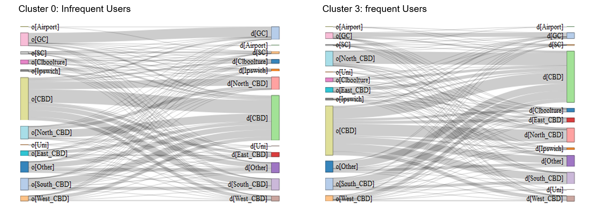

## Modelling Objective and Subjective Public Transport Performance

Objective: Establish the relationship between customer satisfaction feedback and observed measures of attributes related to network performance.

 - Developed a Latent Factor Model that categorized attributes based on their effects on passengers’ satisfaction.
 - Developed a Three Factor Structure Model to illustrate passengers have different expectations to different types of public transport attributes.
 - Matched survey data with smartcard transaction to evaluate how the actual network performance would influence people’s satisfaction and identified the key performance metrics.
 - Presented results at TRANSITDATA2020 in Toronto, helping transit operators to make investment strategies that improve passengers’ satisfaction with public transport. 

[Link to the presentation](https://www.youtube.com/watch?v=4AmQ6SHDylA)

Figure 1: Marginal improments of objective service performance 

Figure 2: Public transport attributes catagorized by the passengers' expectations, derived from the Three Factor Structure Model 

## Exploring Infrequent Use of Public Transport in Brisbane

Objective: Explore the travel patterns of infrequent users of public transport

 - Processed the one-year smart card data in Brisbane.
 - Clustered public transport users based on regularity and visualized the travel time and locations of infrequent public transport users.
 - Presented results at TRANSITDATA2019 conference in Paris, helping in transit operators to develop demand responsive services for infrequent public transport users

Clusters of users based on the frequency of using public transport

 
The distribution of travel modes of each cluster

 
Comparison of spatial travel patterns for infrequent and frequent public transport users

 

 

